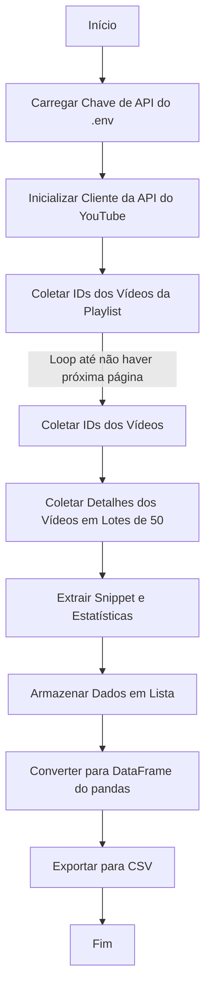

# Extrator de Dados de Playlists do YouTube

Este script Python coleta detalhes de vídeos de uma playlist específica do YouTube usando a API de Dados do YouTube v3 e exporta os dados para um arquivo CSV.

## Pré-requisitos

- Python 3.6 ou superior
- Bibliotecas necessárias:
  - `pandas`
  - `google-api-python-client`
  - `python-dotenv`
- Uma chave de API válida do YouTube Data (configurada no Google Cloud Console)

## Configuração

1. **Instalar dependências**:
   ```bash
   pip install pandas google-api-python-client python-dotenv
   ```

2. **Configurar ambiente**:
   - Crie um arquivo `.env` na raiz do projeto.
   - Adicione sua chave de API do YouTube:
     ```plaintext
     YOUTUBE_API_KEY=sua_chave_api_aqui
     ```

3. **Configurar playlist**:
   - Atualize a variável `PLAYLIST_ID` no script com o ID da playlist do YouTube desejada (encontrado na URL da playlist).

## Como Funciona

O script executa as seguintes etapas:
1. Carrega a chave de API do arquivo `.env`.
2. Usa a API de Dados do YouTube para:
   - Coletar os IDs dos vídeos da playlist especificada.
   - Obter detalhes (título, descrição, data de publicação, curtidas, visualizações, comentários e URL da miniatura) de cada vídeo.
3. Armazena os dados em um DataFrame do pandas.
4. Exporta os dados para um arquivo CSV chamado `youtube_playlist_data.csv`.

### Fluxo Lógico

Abaixo está um fluxograma Mermaid ilustrando a lógica do script:



## Uso

1. Certifique-se de que o arquivo `.env` contém sua chave de API.
2. Atualize o `PLAYLIST_ID` no script.
3. Execute o script:
   ```bash
   python script.py
   ```
4. Verifique o arquivo de saída `youtube_playlist_data.csv` no diretório do projeto.

## Saída

O arquivo CSV contém as seguintes colunas:
- `video_id`: ID único do vídeo
- `titulo`: Título do vídeo
- `descricao`: Descrição do vídeo
- `data_publicacao`: Data de publicação
- `likes`: Número de curtidas
- `views`: Número de visualizações
- `comentarios`: Número de comentários
- `thumbnail_url`: URL da miniatura em alta resolução

## Observações

- O script lida com paginação para playlists com mais de 50 vídeos.
- As requisições à API são feitas em lotes (50 vídeos por requisição) para otimizar o desempenho.
- Certifique-se de que sua chave de API tenha cota suficiente para playlists grandes.
- O CSV de saída usa codificação UTF-8 com BOM (`utf-8-sig`) para compatibilidade.

## Solução de Problemas

- **Problemas com a Chave de API**: Verifique se sua chave de API é válida e tem acesso à API de Dados do YouTube.
- **Cota Excedida**: Verifique sua cota de API no Google Cloud Console.
- **CSV Vazio**: Certifique-se de que o ID da playlist está correto e que a playlist é acessível publicamente.